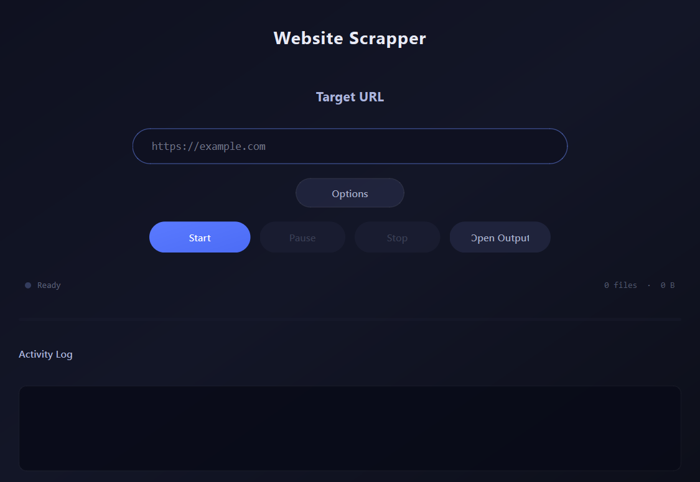

<div align="center">

# Website Scrapper

A modern desktop tool to mirror and download entire websites locally.
Built with **Python** and **PySide6**.



---

</div>

## About

**Website Scrapper** is a lightweight website mirroring tool.
Enter any URL and the tool will recursively crawl the site, downloading all pages and assets (HTML, CSS, JS, images, fonts, media, documents) while preserving the original file structure.

### Features

- **Recursive BFS crawling** with configurable depth (1–10)
- **Asset selection** — toggle which file types to download (images, CSS, JS, fonts, media, documents)
- **Same-domain filtering** — restrict crawling to the target domain
- **Base64 image extraction** — embedded data URIs are decoded and saved
- **Pause / Resume / Stop** — full control over the crawl process
- **Live activity log** with color-coded output
- **Progress tracking** — real-time file count and total size
- **Dark UI** — clean, modern interface with smooth animations

---

## Installation

> **Prerequisites:** Python 3.10+

```bash
# Clone the repository
git clone https://github.com/Kyliandmc/website-scrapper.git
cd website-scrapper

# Install dependencies
pip install -r requirements.txt
```

---

## Usage

```bash
python main.py
```

1. Paste the target URL in the input field
2. Click **Options** to configure crawl depth, asset types and output directory
3. Click **Start** to begin mirroring
4. Use **Pause** / **Stop** to control the process
5. Click **Open Output** to browse downloaded files

---

## Project Structure

```
website-scrapper/
├── main.py            # Entry point
├── engine.py          # Crawler engine (BFS, asset downloading, link extraction)
├── ui.py              # PySide6 interface and theme
├── requirements.txt   # Python dependencies
└── output/            # Default download directory
```

---

## Dependencies

| Package | Description |
|---|---|
| `PySide6` | Qt6 bindings for the desktop UI |
| `requests` | HTTP client for downloading pages and assets |
| `beautifulsoup4` | HTML parsing and link/asset extraction |
| `pip-system-certs` | System SSL certificates for Python on Windows |

